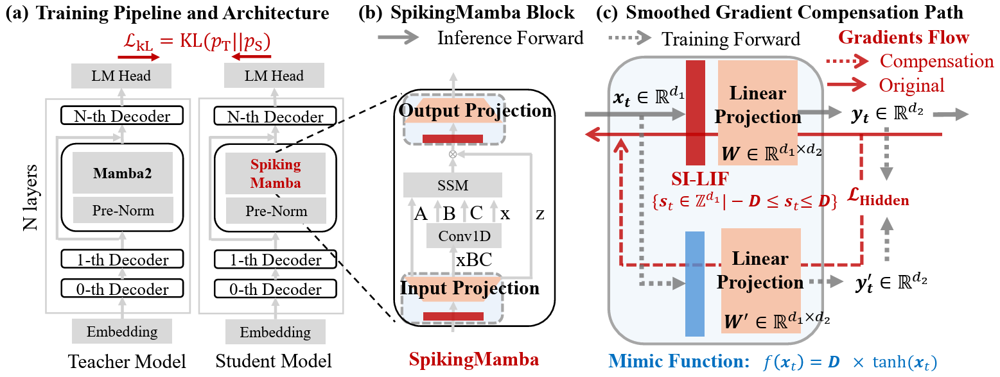

# SpikingMamba: Towards Energy-Efficient Large Language Models via Knowledge Distillation from Mamba

This repository contains the training code for **SpikingMamba**, an energy-efficient family of large language models based on **spiking neural networks (SNNs)** distilled from **Mamba**. It accompanies the paper:

> SpikingMamba: Towards Energy-Efficient Large Language Models via Knowledge Distillation from Mamba  
> Yulong Huang*, Jianxiong Tang*, Chao Wang*, Ziyi Wang, Jianguo Zhang, Zhichao Lu, Bojun Cheng✉, Luziwei Leng✉, TMLR 2026.  
> OpenReview: https://openreview.net/forum?id=uxb2jcCLxt

<!-- <div style="display: flex; justify-content: center;">
  
</div> -->


Large Language Models (LLMs) usually rely on dense matrix multiplications, which makes them energy-intensive and hard to deploy on edge devices. SpikingMamba addresses this limitation by replacing dense computations with sparse spike-based accumulations, significantly improving energy efficiency with minimal loss in accuracy.

Experiments show that **SpikingMamba‑1.3B** achieves:

- **4.76× energy benefit** compared to its Mamba teacher;
- Only **4.78% zero-shot accuracy gap** before RL;
- After RL, the gap is further reduced to **2.23%**.
 

## contents
- [Overview](#overview)
- [Repository Structure](#repository-structure)
- [Installation](#installation)
- [Getting Started](#getting-started)
- [Evaluation](#evaluation)
- [Citation](#citation)
- [Acknowledgements](#acknowledgements)

## Overview

SpikingMamba integrates three key components:

- **SI‑LIF neuron (Signed-Integer Leaky Integrate-and-Fire)**  
  A spiking neuron that uses signed multi-level spikes to preserve semantic polarity and magnitude, enabling more expressive SNNs while still allowing efficient integer arithmetic.

- **Smoothed Gradient Compensation (SGC) path**  
  A training-only auxiliary path that smooths gradients through quantization and spike functions, mitigating accuracy loss from discretization. The SGC path is removed at inference time, so the deployed model remains fully spike-driven and efficient.

- **Single-stage knowledge distillation from Mamba**  
  A direct, single-stage distillation pipeline that transfers zero-shot capabilities from a pretrained Mamba teacher to a SpikingMamba student without full SNN pretraining from scratch. This significantly reduces the training cost of high-performance SNN-based LLMs. A further **reinforcement learning (RL)** phase can be applied to close the performance gap even more.

## Repository Structure

The main components of this repository are:

- `alignment/` – alignment utilities and configs (data processing, decontamination, model helpers)  
- `train_smamba/` – training entry points for SpikingMamba  
  - `distill_smamba.py` – main script for distillation training  
  - `distill_smamba.yaml` – default configuration for distillation  
  - `rl_smamba_dpo.py` – main script for DPO RL
  - `rl_smamba_dpo.yaml` – default configuration for DPO RL
- `trainer/` – generic training logic   
- `train_configs.py` – central configuration and argument parsing for experiments  
- `dataset.py` – dataset and dataloader utilities  
- `environment.yml` – full environment specification used in our experiments  
- `deepspeed_zero3.yaml`, `multi_gpu.yaml` – distributed / DeepSpeed configuration files  
- `util.py` – small utility helpers used across scripts  
- `LICENSE`, `README.md` – license and documentation  

Please adapt this section to match the exact directory names in your local copy.

## Installation

We recommend using a recent CUDA-enabled PyTorch environment.

```bash
conda create -n spikingmamba python=3.10 -y
conda activate spikingmamba

# Install PyTorch (adjust the CUDA / version to your system)
pip install "torch==2.1.1+cu118" --index-url https://download.pytorch.org/whl/cu118

# Install project dependencies
pip install -r requirements.txt
```

If you rely on an existing Mamba / Mamba-SSM implementation, please make sure to install compatible versions (e.g., `mamba-ssm`, `causal-conv1d`, `flash-attn`, etc.) as specified in your `environment.yml` or `requirements.txt`.

## Getting Started

### End-to-end Distillation Phase

We provide a configuration for end-to-end distillation from a Mamba teacher to a SpikingMamba student, using a combination of hidden-state matching and KL loss.

```bash
ACCELERATE_LOG_LEVEL=info \
  accelerate launch --config_file deepspeed_zero3.yaml \
  train_smamba/distill_smamba.py \
  train_smamba/distill_smamba.yaml   # You can inspect and modify this config file first
```
This should roughly take 1–2 days on 8×80G A100 GPUs.

### Reinforcement Learning (Optional, DPO)

After distillation, you can optionally apply DPO-style RL to further align the model. The script and yaml allow you to specify the base model path inside the config (e.g., student / initial model).

```bash
ACCELERATE_LOG_LEVEL=info \
  accelerate launch --config_file deepspeed_zero3.yaml \
  train_smamba/rl_smamba_dpo.py \
  train_smamba/rl_smamba_dpo.yaml   # Edit this config to set model / teacher / reward paths
```


This should roughly take a few hours on 8×80G A100 GPUs.

### Loading a Pretrained SpikingMamba Model

The following example shows how to load a SpikingMamba model and generate text. Please update class and module names to match your implementation.

```python
import torch
from transformers import AutoTokenizer
from smamba_mixer_seq.models.mixer_seq_simple_smamba import MambaLMHeadModel as SpikingMamba

model_name = "your-org/SpikingMamba-1.3B"  # or a local path
dtype = torch.bfloat16

tokenizer = AutoTokenizer.from_pretrained(model_name)
model = SpikingMamba.from_pretrained(
    model_name,
    torch_dtype=dtype,
).cuda()
model.eval()

prompt = "Explain why spiking neural networks can be more energy efficient than transformers."
inputs = tokenizer(prompt, return_tensors="pt").to(model.device)

with torch.no_grad():
    outputs = model.generate(
        **inputs,
        max_new_tokens=128,
        do_sample=False,
        top_k=1,
    )

print(tokenizer.decode(outputs[0], skip_special_tokens=True))
```

## Evaluation

We use the `lm-evaluation-harness` for standard benchmark evaluations.

You can either install it directly:

```bash
pip install "lm_eval[hf]"
```

or clone the repository:

```bash
git clone https://github.com/EleutherAI/lm-evaluation-harness.git
cd lm-evaluation-harness
git checkout big-refactor
pip install -e .
```

Then run:

```bash
python lm_harness_eval.py \
  --model SpikingMamba \
  --model_args pretrained=[MODEL_PATH] \
  --tasks mmlu \
  --device cuda --batch_size 16
```


## Citation
If you use this codebase, or otherwise found our work valuable, please cite:

```bibtex
@article{
huang2026spikingmamba,
title={SpikingMamba: Towards Energy-Efficient Large Language Models via Knowledge Distillation from Mamba},
author={Yulong Huang and Jianxiong Tang and Chao Wang and Ziyi Wang and Jianguo Zhang and Zhichao Lu and Bojun Cheng and Luziwei Leng},
journal={Transactions on Machine Learning Research},
issn={2835-8856},
year={2026},
url={https://openreview.net/forum?id=uxb2jcCLxt},
}
```

## Acknowledgements

This repository builds upon and is inspired by several excellent open-source projects:

- **MambaInLlama** – hybrid Mamba/Transformer distillation codebase and evaluation setup:  
  `https://github.com/jxiw/MambaInLlama`
- **lm-evaluation-harness** – general-purpose language model evaluation framework:  
  `https://github.com/EleutherAI/lm-evaluation-harness`
- **mamba-ssm** – reference implementation of Mamba state-space models and kernels:  
  `https://github.com/state-spaces/mamba`
